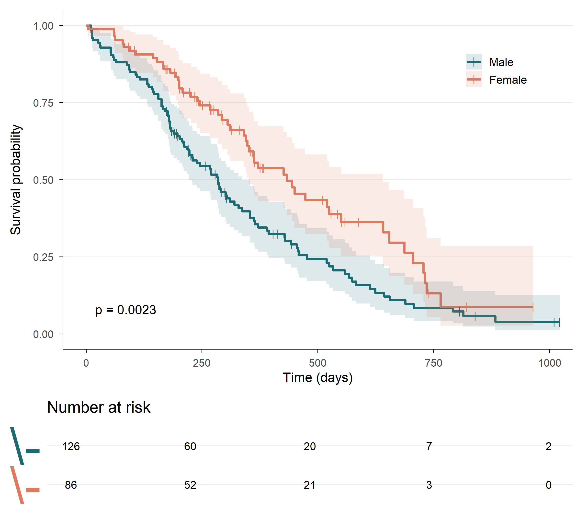

# Survival Analysis in R

A reusable template for time-to-event analysis: Kaplan–Meier curves, Cox
proportional hazards regression, assumption checking, and publication-ready tables.

Runs on the built-in `survival::lung` dataset (NCCTG Lung Cancer, 228 patients),
so no data download is needed.



---

## What it covers

- Kaplan–Meier estimation with risk table and log-rank test
- Baseline characteristics table (`tbl_summary`)
- Cox proportional hazards regression
- **Proportional hazards assumption check** via Schoenfeld residuals (`cox.zph`) —
  the step most tutorials skip, and the assumption the model depends on
- Unadjusted and adjusted hazard ratios side by side
- Export to Word via `gtsummary` + `gt`

---

## Requirements

```r
install.packages(c("survival", "survminer", "gtsummary", "gt",
                   "dplyr", "tidyr", "labelled"))
```

Tested with R 4.4.2 — survival 3.6-6, survminer 0.5.2, gtsummary 2.5.1, gt 1.3.0,
dplyr 1.2.0, tidyr 1.3.2.

gtsummary 2.x is required. `modify_column_merge()` and `modify_header()` behave
differently on 1.x and the script will error.

---

## Using your own data

Replace the preprocessing block. The script needs a time column, an event indicator
coded 0 = censored / 1 = event, and your covariates. Everything downstream follows.

Two choices worth keeping if you adapt it:

- **Complete cases handled up front.** `coxph` drops `NA` rows silently, so otherwise
  the unadjusted and adjusted models get fitted on different samples and aren't
  comparable.
- **Events per variable.** Aim for at least 10 events per covariate. This example has
  150 events and 5 model terms.

---

## Example output

In the lung data, age is significant unadjusted (HR 1.02, p = 0.027) but not after
adjustment (p = 0.177) — a clean case of confounding, and the reason the side-by-side
table is worth producing.

The PH assumption holds here (global p = 0.393). If it hadn't, the options are
stratifying on the offending variable, adding a time-varying coefficient, or moving
to an accelerated failure time model.

---

## Note

A learning template, not a research finding. The `lung` results are shown only to
demonstrate the workflow — check your own assumptions and pick covariates from your
study design rather than copying these.

---

## License

MIT
